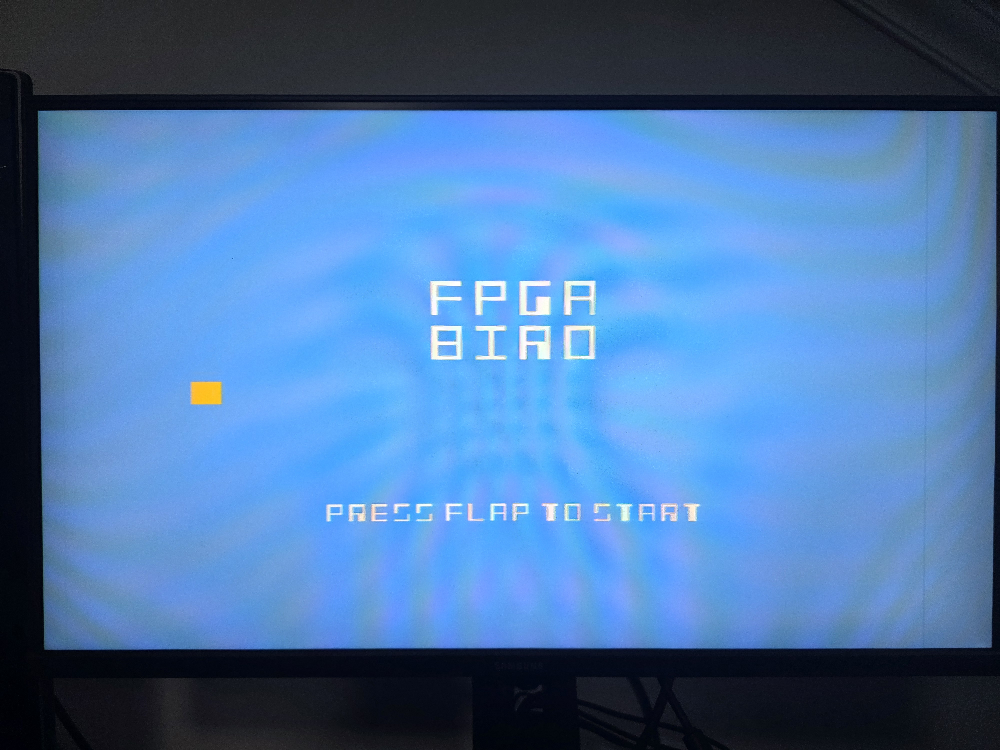

# FPGA Bird (Flappy Bird em VHDL)

Um port simples do jogo "Flappy Bird" implementado inteiramente em VHDL para a placa FPGA **DE10-Lite (MAX10)**, feito como projeto final para a disciplina de Lógica Reconfigurável (ELTE3) do curso de Engenharia de Computação da UTFPR. O projeto utiliza uma renderização VGA 640x480 em tempo real, lógica de estado, detecção de colisão e placar em displays 7-segmentos.

*Start Screen*

*Gameplay*

---

## 🚀 Funcionalidades

* **Display VGA 640x480 @ 60Hz:** Jogo renderizado em tempo real com um clock de 25 MHz (gerado por PLL).
* **Máquina de Estados de 3 Níveis:**
    1.  **Tela Inicial:** Mostra o título "FPGA BIRD" e a instrução "PRESS FLAP TO START". O jogo fica congelado.
    2.  **Jogo Ativo:** O pássaro voa, os canos se movem e a pontuação é contada.
    3.  **Tela de Fim de Jogo:** O jogo congela, exibe "GAME OVER" na tela.
* **Detecção de Colisão:** O jogo termina se o pássaro colidir com um dos canos ou com o chão.
* **Placar em Tempo Real:** A pontuação (0-99) é exibida nos displays 7-segmentos `HEX1` e `HEX0`.
* **Dificuldade Progressiva:** A velocidade de movimento dos canos aumenta gradualmente conforme o placar do jogador sobe.
* **Feedback Visual:** Os 10 LEDs (`LEDR`) da placa piscam em uníssono na tela de "Game Over".

---

##  hardware e Software

### Hardware
* **Placa:** DE10-Lite (MAX10 10M50DAF484C7G)
* **Monitor:** Qualquer monitor com entrada VGA.

### Software
* **Intel Quartus Prime Lite Edition (v18.1)** (ou mais recente)

---

## 🎮 Como Jogar

* **Reset:** Mova a chave `SW[0]` para baixo e para cima para (re)iniciar o jogo. O jogo começará na tela inicial.
* **Iniciar / Pular (Flap):** Pressione o botão `KEY[0]` para pular. O primeiro "flap" inicia o jogo.
* **Objetivo:** Evite os canos! O placar aumenta em 1 a cada cano ultrapassado com sucesso.

---

## 📁 Estrutura do Projeto

O projeto utiliza um design modular em VHDL, com todos os componentes unificados em um diagrama de blocos de nível superior (`FPGA_Bird.bdf`).

* **`FPGA_Bird.bdf`**: O diagrama de blocos que conecta todos os módulos VHDL e define as entradas/saídas da placa.
* **`VGA_drvr.vhd`**: Gera os sinais de sincronismo VGA (HSYNC, VSYNC) e os contadores de pixel (X, Y).
* **`pll_vga.vhd`** (IP Core): Gera o clock de 25 MHz para o VGA a partir do clock de 50 MHz da placa.
* **`game_clock_divider.vhd`**: Reduz o clock de 25 MHz para um "tick" de jogo (60 Hz) para atualizar a física do jogo (movimento e gravidade).
* **`bird_logic.vhd`**: Controla a física do pássaro, gerenciando a posição vertical (`bird_y`) com base na gravidade (a cada tick) e no "flap" (entrada do `KEY[0]`).
* **`pipe_logic.vhd`**: Controla o movimento dos canos. Ele gera a posição horizontal (`pipe_x`), a altura da abertura (`pipe_gap_y`) e ajusta sua velocidade de movimento com base na entrada `i_score`.
* **`game_manager.vhd`**: O "cérebro" do jogo.
    * Contém a Máquina de Estados principal (`s_ready`, `s_playing`, `s_game_over`).
    * Detecta colisões comparando as coordenadas do pássaro e dos canos.
    * Contém o placar (`r_score`), incrementando-o quando o pássaro passa um cano.
    * Controla os LEDs piscantes e as saídas de placar.
* **`pixel_drawer.vhd`**: Módulo puramente combinacional que decide a cor de cada pixel (`R`, `G`, `B`) que será enviado ao `VGA_drvr`. Ele desenha o fundo, o pássaro, os canos ou o texto com base nas flags de estado do `game_manager`.
* **`ROM1.vhd`** (IP Core): Uma memória ROM que serve como um decodificador BCD simples que converte os dígitos do placar (0-9) para o formato de 7 segmentos (ativo-baixo) da placa. usando um .mif

---

## 🔧 Como Compilar

1.  Clone o repositório.
2.  Abra o arquivo `.qpf` (Quartus Prime Project File) no Quartus.
3.  Certifique-se de que as atribuições de pinos (Pin Planner) estão corretas para a DE10-Lite (os pinos de VGA, `SW`, `KEY`, `LEDR` e `HEX`).
4.  Execute o "Compile Design".
5.  Use o "Programmer" para carregar o arquivo `.sof` gerado na FPGA.
6.  Divirta-se!
